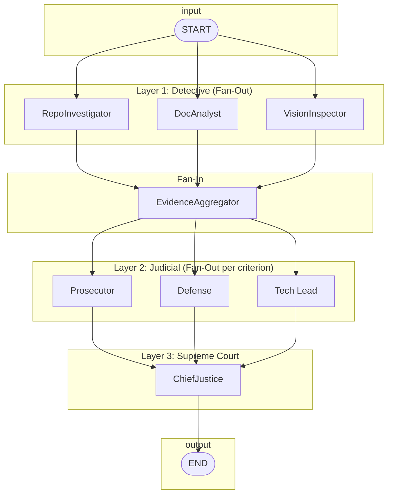

# System Architecture: Automaton Auditor

**Version:** 1.0  
**Governed by:** [System Requirement Specification](./system_requirement_spec.md) (SRS), [Specs Meta](./_meta.md) (_meta)

This document describes the system architecture of the Automaton Auditor: component structure, state model, runtime flow, and key design decisions. It does not introduce new requirements; it elaborates how the SRS and _meta are realized architecturally.

---

## 1. Document References

| Document | Role |
|----------|------|
| [system_requirement_spec.md](./system_requirement_spec.md) | Requirements authority; all "shall" statements trace here. |
| [_meta.md](./_meta.md) | Technical standards, tech stack, API patterns, file layout. |

---

## 2. System Context

### 2.1 Actors and Boundaries

```
                    +------------------+
                    |   Operator /     |
                    |   CLI / Script   |
                    +--------+---------+
                             |
                             | repo_url, pdf_path
                             v
    +------------------------------------------------------------------------+
    |                     AUTOMATON AUDITOR (this system)                    |
    |  ┌─────────────┐   ┌─────────────────┐   ┌─────────────────────────┐  |
    |  | Detective   |   | Judicial         |   | Supreme Court           |  |
    |  | Layer       |-->| Layer            |-->| (Chief Justice)          |  |
    |  └─────────────┘   └─────────────────┘   └─────────────────────────┘  |
    +------------------------------------------------------------------------+
                             |
                             | Markdown Audit Report
                             v
                    +------------------+
                    |  File system /    |
                    |  audit/report_*  |
                    +------------------+
```

- **Inputs:** GitHub repository URL, PDF report path (and optionally rubric path). Supplied by operator or invoking process.
- **Outputs:** A Markdown audit report (serialized `AuditReport`) written to a configured directory (e.g. `audit/report_*`).
- **External dependencies:** Git (clone/fetch), LLM APIs (LangChain-compatible), PDF parsing (e.g. Docling), vision API (optional at runtime). All secrets via environment variables (SRS NFR-2, _meta §2.3).

### 2.2 High-Level Data Flow

1. **Ingest:** Load rubric (e.g. `rubric.json`); validate repo URL and PDF path.
2. **Detect:** Clone repo (sandboxed), ingest PDF (chunked); run RepoInvestigator, DocAnalyst, VisionInspector in parallel; each produces `Evidence` keyed by dimension/artifact.
3. **Aggregate:** EvidenceAggregator merges Detective outputs into state (reducers prevent overwrites).
4. **Judge:** For each rubric dimension, run Prosecutor, Defense, Tech Lead in parallel on the same evidence; each produces `JudicialOpinion`.
5. **Synthesize:** ChiefJusticeNode applies hardcoded rules, resolves conflicts, builds `AuditReport`.
6. **Emit:** Serialize `AuditReport` to Markdown and write to disk.

---

## 3. Architectural Style and Patterns

### 3.1 Primary Style: Digital Courtroom

The system implements a **Hierarchical State Graph** (LangGraph) styled as a **Digital Courtroom** (SRS §2, §3; _meta §3.1):

- **Layer 1 — Detective Layer:** Forensic sub-agents; facts only; structured `Evidence`.
- **Layer 2 — Judicial Layer:** Three personas (Prosecutor, Defense, Tech Lead) in parallel per criterion; structured `JudicialOpinion`.
- **Layer 3 — Supreme Court:** ChiefJusticeNode; deterministic synthesis; `AuditReport` → Markdown.

### 3.2 Concurrency Patterns

- **Fan-out:** Multiple nodes run concurrently from a single logical trigger (Detectives from start/context; Judges from aggregated evidence per criterion).
- **Fan-in:** A single synchronization node (EvidenceAggregator) collects all Detective results before any Judge runs; all Judge results feed into ChiefJustice (SRS FR-16–FR-18; _meta §3.2).
- **State reducers:** Fields updated by parallel nodes use `Annotated[..., operator.add]` (lists) or `Annotated[..., operator.ior]` (dicts) so concurrent writes merge instead of overwrite (SRS FR-5; _meta §2.2).

### 3.3 Dialectical Model

- **Thesis–Antithesis–Synthesis:** Three distinct judge personas with conflicting prompts produce three opinions per criterion; Chief Justice applies **hardcoded** rules (security, evidence, functionality, dissent, variance) to produce a single verdict—not an average (SRS §3.3, §3.4; _meta §3.3).

---

## 4. State Model

All shared data lives in a single **AgentState** (TypedDict + Pydantic). Defined in `src/state.py` (SRS §7.1; _meta §5.6).

### 4.1 AgentState (Graph State)

| Field | Type | Reducer | Description |
|-------|------|---------|-------------|
| `repo_url` | `str` | — | Input: target repository URL. |
| `pdf_path` | `str` | — | Input: path to PDF report. |
| `rubric_dimensions` | `List[Dict]` | — | Loaded from rubric JSON; dimensions with id, name, target_artifact, forensic_instruction, etc. |
| `evidences` | `Dict[str, List[Evidence]]` | `operator.ior` | Evidence per dimension/key; merged from parallel Detectives. |
| `opinions` | `List[JudicialOpinion]` | `operator.add` | All judge opinions; appended by parallel Judge nodes. |
| `final_report` | `AuditReport` | — | Set by ChiefJusticeNode. |

Reducer use ensures parallel Detective writes merge into `evidences`, and parallel Judge writes append to `opinions` (SRS FR-5).

### 4.2 Core Data Types (Pydantic)

- **Evidence:** `goal`, `found`, `content?`, `location`, `rationale`, `confidence`. Detective output; no opinion.
- **JudicialOpinion:** `judge` (Literal["Prosecutor"|"Defense"|"TechLead"]), `criterion_id`, `score` (1–5), `argument`, `cited_evidence` (list).
- **CriterionResult:** `dimension_id`, `dimension_name`, `final_score`, `judge_opinions`, `dissent_summary?`, `remediation`.
- **AuditReport:** `repo_url`, `executive_summary`, `overall_score`, `criteria` (list of CriterionResult), `remediation_plan`.

All are Pydantic `BaseModel`; no plain dicts for these (SRS FR-1–FR-4; _meta §2.2).

---

## 5. Component View

### 5.1 Module Map

```
src/
├── state.py           # AgentState, Evidence, JudicialOpinion, CriterionResult, AuditReport
├── graph.py            # StateGraph definition: nodes, edges, parallel branches, conditional edges
├── tools/
│   ├── repo_tools.py   # clone_repo, extract_git_history, analyze_graph_structure (sandboxed; AST)
│   └── doc_tools.py    # ingest_pdf, query_doc (RAG-lite); extract_images_from_pdf, analyze_diagram (vision)
└── nodes/
    ├── detectives.py   # repo_investigator_node, doc_analyst_node, vision_inspector_node
    ├── judges.py       # prosecutor_node, defense_node, tech_lead_node (or combined judge dispatcher)
    └── justice.py      # evidence_aggregator_node, chief_justice_node
```

Config and assets at project root: `rubric.json`, `.env.example`, `pyproject.toml` (SRS §7.1–§7.2; _meta §5.6).

### 5.2 Layer Responsibilities

| Layer | Modules | Responsibility |
|-------|---------|----------------|
| **State & config** | `state.py`, `rubric.json` | Typed state schema; rubric dimensions and synthesis rules. |
| **Tools** | `tools/repo_tools.py`, `tools/doc_tools.py` | Sandboxed git/AST; PDF chunking/query; image extract/vision. No state mutation. |
| **Detective** | `nodes/detectives.py` | Invoke tools; filter rubric by `target_artifact`; emit `Evidence` into state. |
| **Aggregator** | `nodes/justice.py` (or detectives) | Optional explicit node to normalize/validate evidence; or implicit fan-in via state. |
| **Judicial** | `nodes/judges.py` | Per dimension: call LLM with persona prompt + `.with_structured_output(JudicialOpinion)`; append to state. |
| **Supreme Court** | `nodes/justice.py` | Apply synthesis rules; build `AuditReport`; serialize to Markdown; write file. |
| **Orchestration** | `graph.py` | Build StateGraph; wire fan-out/fan-in and conditional edges. |

---

## 6. Runtime Architecture: StateGraph

### 6.1 Node Topology

The graph is a **hierarchical pipeline** with two parallel sections (Detectives, then Judges) and one synthesis node.



- **Conditional edges** (SRS FR-19): From START or AGG, optional branches for "Evidence Missing" or "Node Failure" to error handling or fallback; exact placement per SRS/rubric.
- **Judge parallelism:** In practice, Judges may be invoked in a loop over dimensions (each dimension: fan-out P, D, T then fan-in to next dimension or to CJ), or as a single parallel batch if the graph abstraction allows. The architecture requires "all three judges run in parallel on the same evidence" **per criterion** (SRS §3.3.2).

### 6.2 Simplified Sequential View

1. **START** → state initialized with `repo_url`, `pdf_path`, `rubric_dimensions`.
2. **RepoInvestigator, DocAnalyst, VisionInspector** run in parallel; each reads dimensions filtered by `target_artifact`, runs tools, writes `Evidence` into `evidences` (reducer: merge).
3. **EvidenceAggregator** (or implicit fan-in): state now has full `evidences`; optional validation/normalization.
4. **For each rubric dimension:** Prosecutor, Defense, Tech Lead run in parallel; each reads aggregated evidence + dimension; calls LLM with `.with_structured_output(JudicialOpinion)`; appends to `opinions` (reducer: add).
5. **ChiefJusticeNode** reads `opinions` and `evidences`; applies synthesis rules; builds `AuditReport`; sets `final_report`; serializes to Markdown and writes to disk.
6. **END.**

### 6.3 Conditional Edges (Error Handling)

- Where required (SRS FR-19): after Detective nodes or after AGG, conditional edges route on e.g. "evidence missing" or "failure" to a dedicated handler (e.g. inject placeholder evidence or mark criterion as failed) so the graph can continue or terminate cleanly.

---

## 7. Detective Layer (Detail)

### 7.1 Nodes

| Node | Target artifact | Tools used | Output |
|------|------------------|------------|--------|
| **RepoInvestigator** | `github_repo` | clone_repo, extract_git_history, analyze_graph_structure (AST) | `Evidence` per repo-related dimension |
| **DocAnalyst** | `pdf_report` | ingest_pdf, query_doc, cross-reference with repo evidence | `Evidence` for theoretical_depth, report_accuracy |
| **VisionInspector** | `pdf_images` | extract_images_from_pdf, analyze_diagram (vision model) | `Evidence` for swarm_visual |

Each node receives only dimensions where `target_artifact` matches its capability (SRS FR-20; _meta §5.4). Tools run in sandboxed/env-isolated manner (SRS FR-6, NFR-4, NFR-5; _meta §5.2).

### 7.2 Tool Contract (Summary)

- **Repo:** `clone_repo(url) -> path` (temp dir); `extract_git_history(path)`; `analyze_graph_structure(path)` (AST-based). No `os.system`; subprocess + return codes (SRS FR-7; _meta §5.2).
- **Doc:** `ingest_pdf(path)` → queryable store; `query_doc(store, question)` (chunked, RAG-lite) (SRS FR-8).
- **Vision:** `extract_images_from_pdf(path)`; `analyze_diagram(image, question)` via vision-capable LLM (SRS FR-9; implementation required, execution optional).

### 7.3 Evidence Flow

Detectives do not opinionate. They output structured `Evidence` (goal, found, content, location, rationale, confidence). State keying (e.g. by dimension id or artifact) is defined in `state.py` and used consistently so EvidenceAggregator and Judges can resolve evidence by criterion.

---

## 8. Judicial Layer (Detail)

### 8.1 Personas and Prompts

| Persona | Philosophy | Prompt focus |
|---------|------------|--------------|
| **Prosecutor** | Trust no one; assume vibe coding | Gaps, security, laziness; argue low score when evidence warrants (e.g. linear pipeline → 1). |
| **Defense** | Reward effort and intent | Effort, intent, workarounds; argue higher score for understanding/process. |
| **Tech Lead** | Does it work? Maintainable? | Soundness, cleanliness, viability; tie-breaker; remediation. |

Prompts are distinct and loaded/parameterized with rubric `judicial_logic` and dimension context (_meta §5.4; SRS FR-11).

### 8.2 Structured Output

Every Judge call uses `.with_structured_output(JudicialOpinion)` (or `.bind_tools()` bound to the same schema). Parse/validation failures trigger retry or error handling (SRS FR-10; _meta §5.3).

### 8.3 Per-Criterion Flow

For each dimension in `rubric_dimensions`:

1. Extract relevant evidence from `evidences` for that dimension.
2. Fan-out: invoke Prosecutor, Defense, Tech Lead in parallel with that evidence and dimension.
3. Each returns one `JudicialOpinion`; append to `opinions` (reducer: add).

Chief Justice later groups `opinions` by `criterion_id` for synthesis.

---

## 9. Supreme Court (Chief Justice)

### 9.1 Role

- **Input:** `opinions` (all Judge outputs), `evidences`, `rubric_dimensions`, and rubric `synthesis_rules`.
- **Logic:** Hardcoded deterministic Python (if/else or rule table), not an LLM-based averager (SRS FR-13; _meta §3.3).

### 9.2 Synthesis Rules (Implemented in Code)

At least (SRS §6.3; _meta §5.4):

- **security_override:** Confirmed security flaw caps score (e.g. 3); overrides Defense effort.
- **fact_supremacy:** Detective evidence overrides Judge opinion (e.g. Defense claim without supporting evidence → overruled).
- **functionality_weight:** Tech Lead’s “modular and workable” carries highest weight for architecture criterion.
- **dissent_requirement:** If score variance > 2, include dissent summary in report.
- **variance_re_evaluation:** When variance > 2, apply re-evaluation logic before final score.

### 9.3 Output

- Build `AuditReport` (executive_summary, overall_score, criteria with final_score, judge_opinions, dissent_summary, remediation per criterion, remediation_plan).
- Serialize to Markdown: **Executive Summary** → **Criterion Breakdown** → **Remediation Plan** (SRS FR-15; _meta §5.5).
- Write to configured path (e.g. `audit/report_*`). Set `final_report` in state.

---

## 10. Rubric and Configuration

### 10.1 Rubric JSON

- **Loaded at runtime** (e.g. `json.load()`); no rubric text hardcoded in node logic (SRS A1; _meta §2.5, §5.4).
- **Contents:** `rubric_metadata`; `dimensions[]` (id, name, target_artifact, forensic_instruction, success_pattern, failure_pattern, judicial logic as needed); `synthesis_rules` (security_override, fact_supremacy, functionality_weight, dissent_requirement, variance_re_evaluation).

### 10.2 Targeting

- **Context builder:** Iterate `dimensions`; for each, select instructions by `target_artifact`.
- **Detectives:** Receive only `forensic_instruction` (and related fields) for dimensions whose `target_artifact` matches (github_repo, pdf_report, pdf_images).
- **Judges:** Receive dimension + `judicial_logic` (and rubric text) for that criterion.
- **Chief Justice:** Uses `synthesis_rules` from rubric when resolving conflicts.

---

## 11. Error Handling and Conditional Edges

- **Invalid repo URL / clone failure:** Handled in repo tools (return error or raise); graph can route via conditional edge to error node or inject “evidence missing” and continue (SRS A2, FR-19).
- **Missing PDF or parse failure:** Similarly; DocAnalyst can emit evidence indicating failure; conditional edge optional.
- **Judge parse failure:** Retry or error path; do not append invalid data to `opinions` (SRS FR-10; _meta §5.3).
- **Conditional edges:** Used where SRS or rubric requires branching (e.g. evidence missing, node failure) (_meta §3.4).

---

## 12. Deployment and Execution

- **Runtime:** Python 3.11+; dependencies via uv and `pyproject.toml` (SRS NFR-1; _meta §4.1).
- **Secrets:** Environment variables only; `.env.example` documents required vars (SRS NFR-2; _meta §4.1).
- **Tracing:** LangSmith enabled via `LANGCHAIN_TRACING_V2=true` for full run inspection (SRS NFR-3; _meta §2.4).
- **Optional:** Dockerfile for containerized execution (SRS §7.2; _meta §4.3).
- **Entry point:** Graph compiled and invoked with initial state (`repo_url`, `pdf_path`, `rubric_dimensions`); report path may be configurable (e.g. env or CLI arg).

---

## 13. Traceability

| Architecture element | SRS | _meta |
|----------------------|-----|--------|
| Hierarchical State Graph, Digital Courtroom | §2, §3 | §3.1 |
| Fan-out/fan-in, reducers | FR-5, FR-16–FR-18 | §3.2, §5.1 |
| Detective nodes and tools | §3.2, FR-6–FR-9 | §5.2, §5.6 |
| Judicial personas, structured output | §3.3, FR-10–FR-11 | §5.3, §5.6 |
| Chief Justice, synthesis rules, report | §3.4, FR-13–FR-15 | §3.3, §5.5 |
| Rubric loading and targeting | FR-12, FR-20–FR-21, A1 | §2.5, §5.4 |
| State model (AgentState, Evidence, etc.) | §4.1, §7.1 | §2.2, §5.6 |
| Conditional edges, error handling | FR-19, A2 | §3.4 |
| Security, sandboxing, env | NFR-2, NFR-4, NFR-5 | §2.3, §4.1 |

---

*End of System Architecture*
